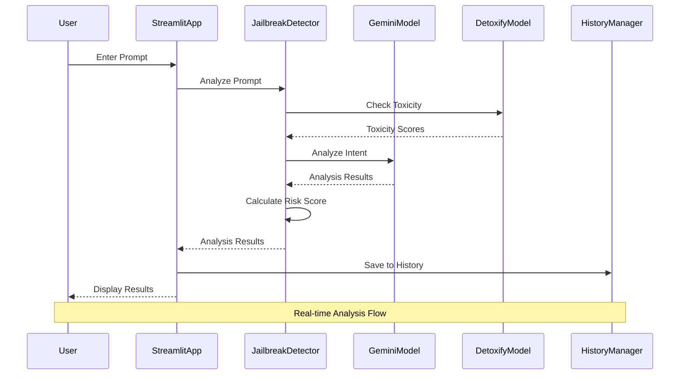
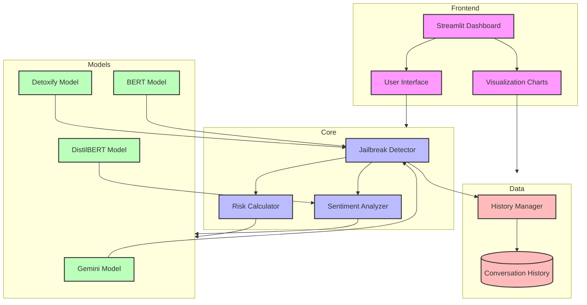

# Jailbreak Detection System Architecture

## Workflow Diagram



## Architecture Diagram



## Component Description

### Frontend Layer
- **Streamlit Dashboard**: Main application interface
- **User Interface**: Input forms, buttons, and interactive elements
- **Visualization Charts**: Data visualization components

### Core Layer
- **Jailbreak Detector**: Main analysis engine
- **Risk Calculator**: Calculates risk scores and thresholds
- **Sentiment Analyzer**: Analyzes text sentiment

### Models Layer
- **Gemini Model**: Handles intent analysis and response generation
- **Detoxify Model**: Analyzes toxicity and harmful content
- **BERT Model**: General text analysis and jailbreak detection
- **DistilBERT Model**: Specialized sentiment analysis

### Data Layer
- **History Manager**: Manages conversation history
- **Conversation Database**: Stores analysis results and history

## Key Features and Flows

### 1. Prompt Analysis Flow
- User inputs prompt
- System performs multi-model analysis
- Results are displayed in real-time
- History is updated

### 2. History Management
- Automatic saving of analysis results
- History viewing and filtering
- Data visualization
- Memory clearing capability

### 3. Risk Assessment
- Multi-factor analysis
- Real-time scoring
- Threshold-based classification
- Detailed explanation generation

### 4. Data Visualization
- Interactive charts
- Real-time updates
- Filtering capabilities
- Export functionality

## System Requirements

- Python 3.8+
- Streamlit
- Google Gemini API
- Detoxify
- BERT (bert-base-uncased)
- DistilBERT (distilbert-base-uncased-finetuned-sst-2-english)
- Pandas
- Plotly

## Setup and Installation

1. Install required packages:
```bash
pip install -r requirements.txt
```

2. Set up environment variables:
```bash
export GOOGLE_API_KEY=your_api_key_here
```

3. Run the application:
```bash
streamlit run streamlit_app.py
``` 