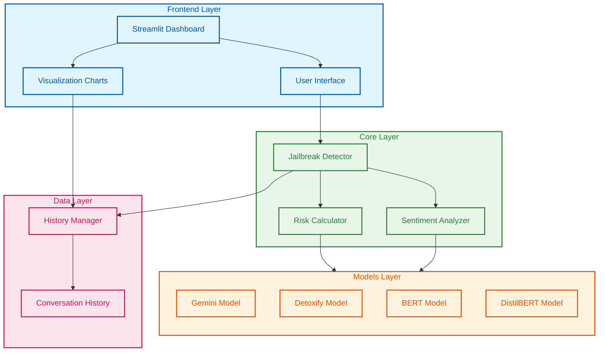

# Jailbreak Detection System

A comprehensive AI safety system designed to detect and prevent harmful content generation, jailbreak attempts, and unethical AI interactions. This system helps ensure AI responses remain within ethical boundaries by analyzing prompts for potential risks and harmful content.

## What is a Jailbreak?

A "jailbreak" in AI terms refers to attempts to bypass or override an AI system's safety measures and ethical guidelines. This system helps detect such attempts to maintain safe and responsible AI interactions.

## Features

- **Prompt Analysis and Classification**: Analyzes user inputs to identify their nature and potential risks
- **Toxicity Detection**: Measures harmful, offensive, or inappropriate content
- **Sentiment Analysis**: Evaluates the emotional tone and intent of the text
- **Context-Aware Detection**: Considers conversation history to better understand context
- **Conversation History Tracking**: Maintains a record of interactions for better analysis
- **Rich Console Output**: Provides detailed, color-coded analysis results

## Setup Instructions

### Prerequisites

- Python 3.8 or higher
- pip
- Git (optional)

### Installation

1. Get the Code:

   ```bash
   git clone https://github.com/muralikrish9/POIsim.git
   cd POIsim
   ```

2. Set Up Python Environment:

   ```bash
   # On Windows:
   python -m venv venv
   .\venv\Scripts\activate

   # On macOS/Linux:
   python3 -m venv venv
   source venv/bin/activate
   ```

3. Install Required Packages:

   ```bash
   pip install -r requirements.txt
   ```

4. Set Up Your API Key:
   Create `.env` file with:

   ```
   GOOGLE_API_KEY=your_google_api_key_here
   ```

5. Download the Model:
   ```bash
   python download_model.py
   ```

### Running the System

1. Start the Program:

   ```bash
   python test_jailbreak.py
   ```

2. Using the System:
   - Type or paste your text when prompted
   - Type 'quit' to exit

### Deploying the dashboard

1. install streamlit:
   pip install streamlit

2. deploy dashboard:
   streamlit run streamlit_app.py

## Project Structure

- `classifier/`: Core detection algorithms
- `test_jailbreak.py`: Main program
- `requirements.txt`: Python dependencies
- `.env`: Configuration file
- `download_model.py`: Script to download the required model files

## System Requirements

- Windows 10/11, macOS, or Linux
- 4GB RAM minimum (8GB recommended)
- 2GB free storage
- Internet connection
- NVIDIA GPU with CUDA support (optional)

## License

MIT License

## Acknowledgments

- Google AI
- Hugging Face
- Open-source community

## System Architecture


